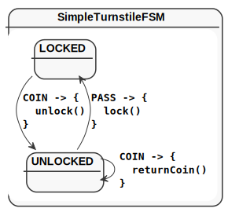

title=KFSM-VIZ
date=2021-08-14
type=project
status=published
summary=KFSM - Visualization of definitions
version=1.5.2.4
~~~~~~
= KFSM Visualization

link:kfsm.html[KFSM] State Definitions can be generated as link:https://plantuml.com[PlantUML] state diagrams or
link:https://asciidoctor.org[Asciidoc] formatted state tables.

== Simple Visualization

The simple visualization uses the resulting definition and can render states and transitions.
You will typically add a method to a unit test class as follows:

[source,kotlin]
----
@Test
fun produceVisualizationTurnstileFSM() {
    println("== TurnStile")
    val visualization = visualize(TurnstileFSM.definition) // <1>
    File("generated", "turnstile.plantuml").writeText(plantUml(visualization)) // <2>
}
----
<1> `TurnstileFSM.definition` is the definition that will be rendered.
<2> The `plantuml` method accepts the output of `visualize` and produces a state diagram in the plantuml format.

== Detail Visualisation

You may invoke the parser from a unit test similar to the simple case.

=== Dependencies

==== Gradle Groovy DSL
[source,groovy]
----
dependencies {
    testImplementation 'io.jumpco.open:kfsm-viz:1.5.2.4'
}
----
==== Gradle Kotlin DSL
[source,kotlin]
----
dependencies {
    testImplementation("io.jumpco.open:kfsm-viz:1.5.2.4")
}
----

[source,kotlin]
----
@Test
fun produceVisualizationTurnstileFSM() {
    println("== Simple TurnStile")
    val visualization = parseStateMachine("SimpleTurnstileFSM", File("src/test/kotlin/SimpleTurnstile.kt")) // <1>
    println(visualization)
    File("generated-parsed", "simple-turnstile.plantuml").writeText(plantUml(visualization)) // <2>
    File("generated-parsed", "simple-turnstile.adoc").writeText(asciiDoc(visualization)) // <3>
}
----
<1> Provide classname for the class holding the definition DSL and the sourcefile where the class may be found.
<2> Use the `plantuml` method to generate the text for a plantuml state diagram.
<3> Use the `asciidoc` method to generate an Asciidoc formatted state table.

== Expected output

== SimpleTurnstileFSM State Chart

=== SimpleTurnstileFSM State Map

|===
| Start | Event[Guard] | Target | Action

| LOCKED
| COIN
| UNLOCKED
a| [source,kotlin]
----
{
unlock()
}
----

| UNLOCKED
| PASS
| LOCKED
a| [source,kotlin]
----
{
lock()
}
----

| UNLOCKED
| COIN
| UNLOCKED
a| [source,kotlin]
----
{
returnCoin()
}
----
|===

=== Simple Turnstile State Diagram

== Examples

More examples can be found at: link:https://github.com/open-jumpco/kfsm-viz[kfsm-viz]

== Gradle Plugin
Use the link:kfsm-viz-plugin.html[kfsm-viz-plugin for Gradle] to make the visualization part of your build without
writing code.

== Resources
* Source link:https://github.com/open-jumpco/kfsm-viz[kfsm-viz]

