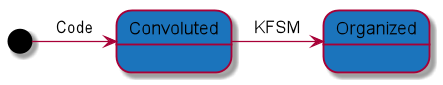

title=KFSM
date=2022-09-04
type=project
status=published
summary=KFSM - A Kotlin finite-state machine
version=1.6.1
~~~~~~
= KFSM - A Kotlin finite-state machine

The KFSM project started as an attempt to learn Kotlin DSL and apply to the problem of producing a finite-state machine implementation
along the lines of link:http://smc.sourceforge.net/[SMC] the State Machine Compiler.

* link:kfsm/index.html[Documentation]
* link:kfsm/javadoc/kfsm/index.html[API Docs]
* link:https://github.com/open-jumpco/kfsm[Source]

